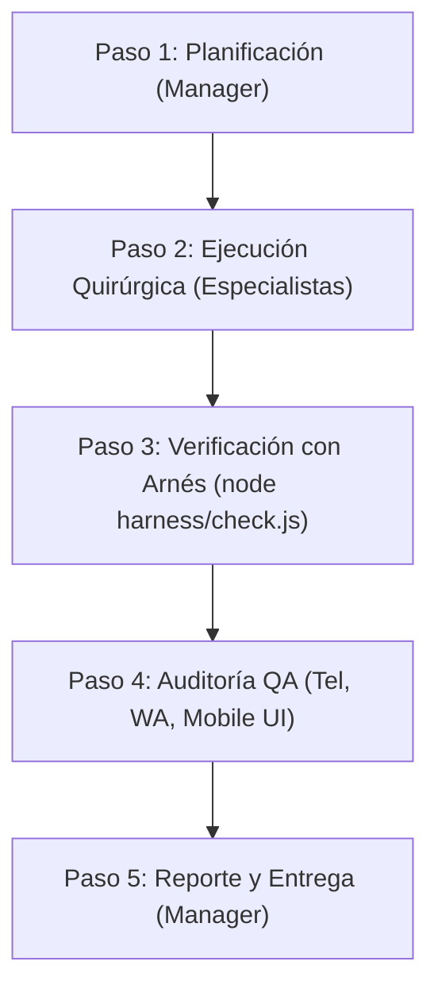

# PROTOCOLO MULTI-AGENTE & SISTEMA ANTI-REGRESIONES — macWave

Bienvenido al sistema operativo de desarrollo de **macWave**. Este documento define la arquitectura de ejecución, la cadena de mando, los roles especializados y las compuertas de calidad estrictas para garantizar máxima conversión de leads y cero regresiones en producción.

---

## 1. ROL CENTRAL: PROJECT MANAGER (ORQUESTADOR PRINCIPAL)
El **Project Manager** es el orquestador principal del proyecto. Ninguna tarea se ejecuta de forma ciega ni improvisada.

### Responsabilidades del Manager:
1. **Desglose Técnico:** Descomponer cada requerimiento del usuario asignándolo a los especialistas técnicos correspondientes.
2. **Coordinación y Cadena de Custodia:** Supervisar la intervención ordenada y no destructiva de cada especialista.
3. **Compuerta de Calidad Obligatoria:** Ningún cambio se da por concluido ni se entrega al usuario sin que el **Experto en Arnés** (`node harness/check.js`) y el **Experto en QA** hayan verificado y aprobado el resultado con cero errores.

---

## 2. EQUIPO DE ESPECIALISTAS Y REGLAS DE ORO

### 🔍 1. Experto en Google Search Console & SEO Técnico
- **Títulos de Alto CTR (> 4%):** Aplicar la fórmula:
  `[Palabra Clave Exacta] + [Dolor Curado / Sin Citas ni Filas / Mismo Día] + [Llamado a la Acción / macWave CDMX]`.
- **Cero Canibalización:** Cada página del sitio debe contar con `<title>`, `<h1>` y `<meta name="description">` únicos y orientados a su intención de búsqueda específica (ej. reemplazo de batería, reparación de cortos, teclado, pantalla, mac mojada).
- **Indexación y Rastreo:**
  - Mantener `sitemap.xml` 100% sincronizado con URLs canónicas existentes y fechas `lastmod` vigentes.
  - Mantener `robots.txt` protegiendo rutas privadas, operativas o administrativas (`/admin`, `/login`, `/dashboard`, `/ops`).
  - Etiquetas canónicas absolutas (`https://macwave.com.mx/...`) en todas las páginas indexables.

### 💬 2. Experto en CRO & Copywriting Persuasivo (Conversión de Leads)
- **Botones de WhatsApp:** Color oficial WhatsApp (`#25D366` o degradado a `#20BD5A`), con tipografía legible, ícono nítido y texto de alta intención transaccional.
- **Mensajes Prellenados Contextualizados:** Cada enlace `https://wa.me/525535757364?text=...` debe estar codificado (`encodeURIComponent`) con un mensaje específico según el servicio o dolor del usuario (ej. *"Hola, necesito reparar una Mac mojada urgente..."* o *"Hola, requiero cambio de batería para MacBook..."*).
- **Aliviadores de Dolor:** Comunicar promesas concretas contra las objeciones habituales:
  - Diagnóstico honesto a nivel componente.
  - Refacciones con garantía por escrito.
  - Servicio express el mismo día en reparaciones clave.
  - Más de 18 años de experiencia comprobable en CDMX.

### 📱 3. Experto en UI / UX Móvil (Mobile-First estilo Apple)
- **Estética Apple Pill:** Botones táctiles redondeados (`border-radius: 980px` o `100px`), altura mínima touch-target de 44px a 48px, padding ergonómico y texto en una sola línea (`white-space: nowrap`) para evitar rupturas de línea en pantallas estrechas.
- **Cero Colisiones:** Prohibido encimar barras fijas inferiores (`#mobileCallBar` o `.sticky-mobile-cta`) con botones flotantes circulares (`#floatingWA` o `.floating-wa-btn`). En páginas con barra fija inferior, el botón flotante debe ocultarse o reposicionarse por encima de la barra mediante media queries.
- **Header Móvil Compacto:** El encabezado en viewport smartphone (≤ 480px) no debe superar 54px–60px de altura para mantener el título principal y el primer CTA en el primer pantallazo (*above the fold*).
- **Barra Fija Inferior Simétrica:** Estructura balanceada 50/50 (Llamar Directo + WhatsApp) en todas las landing pages transaccionales.

### 💻 4. Experto en Frontend (HTML5 / CSS3 / Vanilla JS)
- **Semántica y Rendimiento:** HTML5 semántico puro, CSS moderno y modular, y Vanilla JavaScript ultrarrápido sin dependencias pesadas innecesarias.
- **Higiene de Marcado:** Prohibido dejar etiquetas sin cerrar, atributos duplicados (ej. dobles `style=""`), scripts rotos o elementos huérfanos después de cierres de sección.
- **Cero Desbordamiento Horizontal:** Probar y asegurar cero scroll horizontal (`overflow-x`) en anchos móviles de 360px a 430px.

### 🗄️ 5. Experto en Backend & Base de Datos
- **Protección de Rutas Privadas:** Páginas internas, cotizadores privados o paneles (`dashboard-ods.html`, `status-ods.html`, `/ops/`) siempre protegidos con `<meta name="robots" content="noindex, nofollow">`.
- **Seguridad de Datos:** Manejo seguro de formularios, claves de Supabase y endpoints de API, previniendo fuga de datos de clientes.

### 🛡️ 6. Experto en Arnés & Guardrails (`harness/check.js`)
- **Script Automatizado de Verificación:** Mantener y ejecutar `node harness/check.js` para auditar:
  1. Integridad de enlaces internos (cero 404s en tags `<a>`, ``, `<link>`, `<script>`).
  2. Validez de sintaxis HTML y ausencia de etiquetas o estilos duplicados.
  3. Parámetros de contacto unificados (teléfono canónico `5535757364` y WhatsApp `525535757364`).
  4. Prevención de colisión UI en componentes fijos móviles.
  5. Sincronización entre archivos locales y `sitemap.xml`.
- **Criterio de Entrega:** Cada cambio DEBE recibir la aprobación del arnés (`EXIT CODE 0`) antes de proceder a la entrega o commit.

### 🧪 7. Experto en QA & Testing (Control de Calidad)
- **Auditoría de Enlaces de Contacto:** Probar que todos los botones `tel:` llamen exactamente al `5535757364` y que los botones `wa.me:` abran el chat correcto con el mensaje prellenado correspondiente.
- **Certificación Visual:** Validar que la interfaz se despliegue de manera impecable en escritorio y móviles (iOS Safari, Android Chrome) sin textos desbordados ni espacios en blanco fantasma.

### 🩺 8. Experto Debugger (Bisturí)
- **Diagnóstico Causa Raíz:** Frente a cualquier anomalía o bug, investigar exhaustivamente el origen del problema antes de modificar código.
- **Modificación Quirúrgica:** Modificar exclusivamente las líneas estrictamente necesarias, protegiendo la funcionalidad preexistente.

### 📦 9. Experto en Git & Version Control (Anti-Armagedón)
- **Commits Atómicos:** Mensajes de commit claros y estructurados por especialidad y componente modificado.
- **Protección del Historial:** Prohibido terminantemente ejecutar `git reset --hard` no autorizados, descartes destructivos o mezclar código ajeno o huérfano.

---

## 3. PARÁMETROS CANÓNICOS DEL NEGOCIO (macWave)

| Parámetro | Valor Oficial Canónico |
| :--- | :--- |
| **Nombre Comercial** | macWave |
| **Teléfono Oficial** | `5535757364` |
| **Formato Teléfono Visual** | `55-3575-7364` |
| **Enlace Telefónico** | `tel:5535757364` |
| **WhatsApp Oficial** | `https://wa.me/525535757364` |
| **Color Primario Marca** | `#009CDF` (Azul macWave) / `#FF6600` (Acento Naranja) |
| **Color Oficial WhatsApp** | `#25D366` (Degradado hover: `#20BD5A`) |
| **Correo Oficial** | `contacto@macwave.com.mx` |
| **Dominio Canónico** | `https://macwave.com.mx` |

---

## 4. PROTOCOLO DE TRABAJO EN 5 PASOS (CADENA DE CUSTODIA)

1. **Paso 1 (Plan):** El Manager recibe la instrucción, define el alcance técnico y asigna tareas a los especialistas requeridos.
2. **Paso 2 (Ejecución):** Los expertos técnicos implementan los cambios con precisión de bisturí sin tocar código ajeno.
3. **Paso 3 (Arnés):** Se corre de forma obligatoria `node harness/check.js` para certificar cero regresiones técnicas y de enlaces.
4. **Paso 4 (QA):** Se verifican manualmente enlaces de contacto, mensajes prellenados y legibilidad mobile.
5. **Paso 5 (Entrega):** El Manager documenta el informe con el desglose por especialista y confirma la aprobación de calidad.
